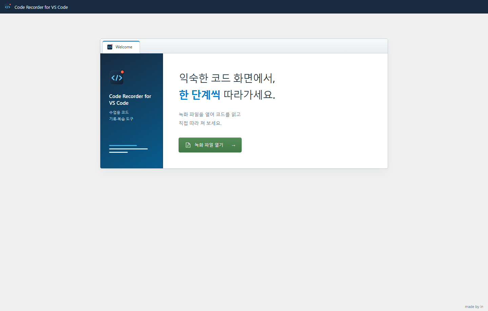
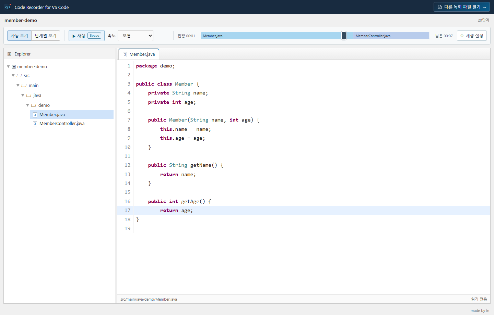
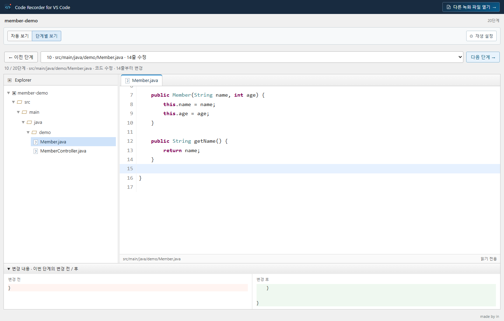
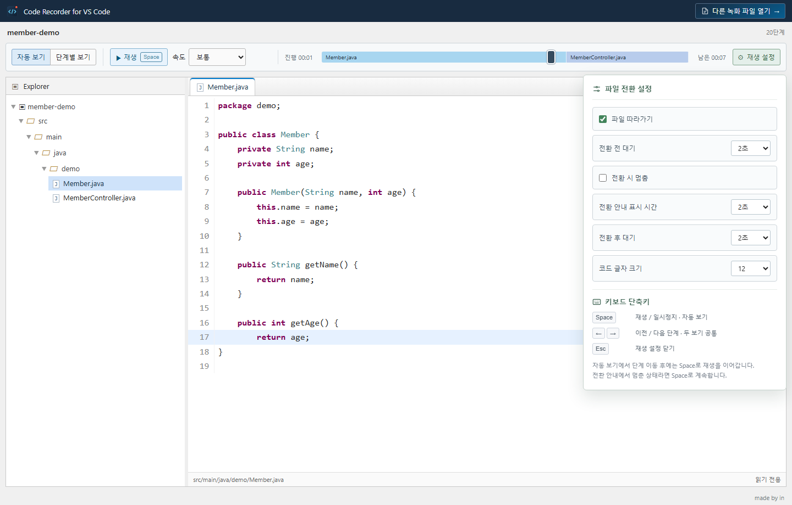

# Code Recorder for Visual Studio Code

코드 작성 과정과 파일 변경을 기록해 녹화 파일로 저장하는 확장 프로그램입니다.

## 설치

### Marketplace

[Visual Studio Marketplace에서 열기](https://marketplace.visualstudio.com/items?itemName=pinnpublic.code-recorder-vscode)

1. VS Code에서 **확장** 화면을 엽니다. (`Ctrl+Shift+X`)
2. 검색창에 `Code Recorder — 수업 코드 녹화`를 입력합니다.
3. Code Recorder를 선택하고 **설치**를 누릅니다.

### VSIX 파일

1. **확장** 화면에서 **⋯ → VSIX에서 설치…**를 선택합니다.
2. 제공된 `code-recorder-vscode-버전.vsix`를 선택합니다.
3. 다시 로드 안내가 나오면 실행합니다. 업데이트도 새 VSIX를 같은 방식으로 설치합니다.

## 코드 녹화

1. 프로젝트를 열고 상태 표시줄의 **코드 녹화**를 누릅니다.
2. 녹화할 프로젝트 또는 폴더를 선택합니다.
3. 파일을 오가며 코드를 작성합니다. 저장하지 않은 편집도 기록됩니다.
4. 상태 표시줄의 **녹화 중 · 종료**를 누르고 녹화 파일을 저장합니다.

탐색기의 폴더를 우클릭해 **녹화 시작**을 선택하거나, `Ctrl+Shift+P`에서 **Code Recorder: 녹화 시작**을 실행해도 됩니다.

기본 파일명: `vscode-프로젝트명-yyyyMMdd-HHmmss.coderec.json`

### 녹화 설정

**Code Recorder: 녹화 설정**에서 제외할 폴더·파일 이름과 기록할 확장자를 지정합니다. 설정 변경은 다음 녹화부터 적용합니다.

숨김 경로, `node_modules`, 빌드 산출물은 기본적으로 제외됩니다. 파일당 2MB, 초기 코드 64MB·5,000개 제한이 있습니다.

### 녹화 파일 열기

**녹화 파일 열기**에서 저장한 `.coderec.json` 파일을 선택합니다.

### 자동 보기

**재생** 또는 **Space**로 재생·일시정지합니다. 속도를 선택하거나 타임라인으로 이동할 수 있습니다.

### 단계별 보기

**이전 단계 / 다음 단계** 또는 **← / →**로 이동하고 변경 전·후 코드를 확인합니다.

### 재생 설정

파일 전환 대기 시간, 전환 시 멈춤, 코드 글자 크기를 조절합니다. 단축키도 여기서 확인할 수 있습니다.

## 기록 복구와 다시 내보내기

저장을 취소했거나 녹화 중 창이 닫혔다면 **Code Recorder: 보관된 녹화 복구 / 다시 내보내기**를 실행합니다. 목록에서 기록을 선택하고 저장 위치를 지정하세요.

복구 기록은 VS Code의 확장 저장 공간에 보관됩니다. 녹화 내용은 외부 서버로 전송하지 않습니다. 시작 코드와 삭제한 코드도 포함되므로 공유 전에 내용을 확인하세요.

## 지원 범위

- VS Code 데스크톱 **1.100.0 이상**. 실행 확인 버전은 Windows의 **1.139.0**입니다.
- 로컬 텍스트 파일 프로젝트. 여러 작업 공간 폴더 중 녹화할 폴더 하나를 선택합니다.
- 미저장 편집, 붙여넣기, 실행 취소·다시 실행, 파일 전환·생성·이동·삭제를 기록합니다.
- 파일로 저장하지 않은 Untitled 문서, 노트북 셀, vscode.dev, 원격·가상 작업 공간은 지원 대상이 아닙니다.
- 외부 도구에서 옮긴 파일은 삭제·생성으로 기록될 수 있습니다.

Microsoft의 공식 확장이 아닙니다.

## 사용 라이선스

MIT 라이선스로 배포됩니다. 저작권 및 라이선스 고지를 유지하면 사용·수정·재배포·상업적 이용이 가능합니다. 자세한 조건은 [LICENSE](LICENSE)를 확인하세요.
